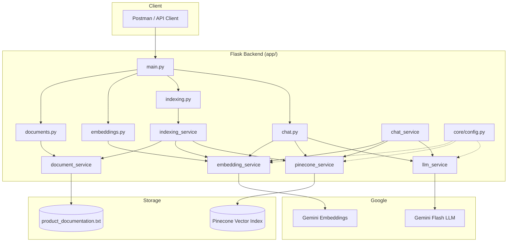
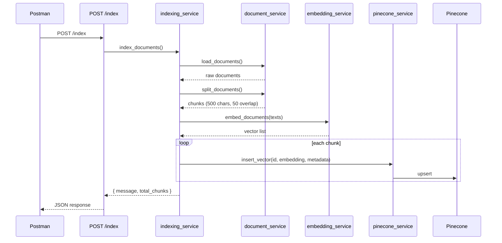
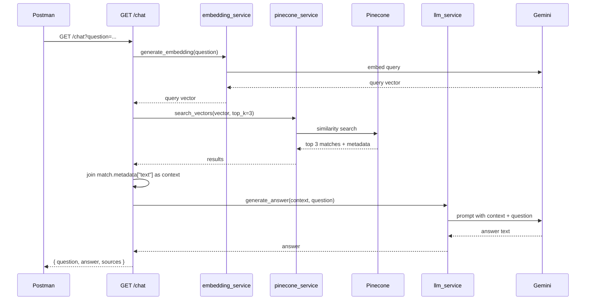

# AI Onboarding Assistant — Backend Architecture

Interview-ready overview of how the backend is designed, how data flows through it, and how to run and demo it with Postman.

---

## 1. What This Project Does

This is a **RAG (Retrieval-Augmented Generation)** backend for an AI onboarding assistant.

It answers questions about **YUKO** (a SaaS review management platform) using a product documentation file — not from the LLM’s general knowledge alone.

**High-level idea:**

1. Load and split product docs into small chunks
2. Convert chunks into vector embeddings
3. Store vectors in **Pinecone** (vector database)
4. When a user asks a question:
   - Embed the question
   - Find the most similar document chunks in Pinecone
   - Send those chunks as **context** to **Google Gemini**
   - Return a grounded answer + source snippets

This keeps answers tied to your internal documentation and reduces hallucination.

---

## 2. Architecture Pattern

We use a **layered architecture** inside Flask:

```
Client (Postman)
       │
       ▼
┌──────────────────┐
│   API Layer      │  app/api/*.py — HTTP routes only
└────────┬─────────┘
         │
         ▼
┌──────────────────┐
│  Service Layer   │  app/services/*.py — business logic
└────────┬─────────┘
         │
         ▼
┌──────────────────┐
│  External APIs   │  Gemini (embeddings + LLM), Pinecone
└──────────────────┘
```

**Why this design?**

| Layer | Responsibility |
|-------|----------------|
| **API** | Accept requests, call services, return JSON |
| **Services** | Document processing, embeddings, vector DB, LLM prompts |
| **Core** | Environment config (API keys, index name) |

Routes stay thin. All RAG logic lives in services, which makes the system easier to explain, test, and extend.

---

## 3. System Architecture Diagram



---

## 4. Folder Structure

```
app/
├── main.py                 # Flask app entry + route registration
├── core/
│   └── config.py           # Loads .env (Gemini + Pinecone keys)
├── api/
│   ├── documents.py        # GET /documents — load & chunk docs
│   ├── embeddings.py       # GET /embedding — test embedding API
│   ├── indexing.py         # POST /index — full indexing pipeline
│   └── chat.py             # GET /chat — RAG Q&A endpoint
└── services/
    ├── document_service.py # Load TXT + split into chunks (LangChain)
    ├── embedding_service.py# Gemini embedding model wrapper
    ├── pinecone_service.py # Upsert + similarity search
    ├── indexing_service.py # Orchestrates indexing pipeline
    ├── llm_service.py      # Gemini prompt + answer generation
    └── chat_service.py     # RAG orchestration (embed → search → LLM)
```

**Source document (outside `app/`):**

```
documents/product_documentation.txt   # YUKO product knowledge base
```

---

## 5. Tech Stack

| Component | Technology | Purpose |
|-----------|------------|---------|
| API framework | **Flask** | REST endpoints & JSON responses |
| Server | **WSGI / Flask** | Standard WSGI web server |
| Document loading | **LangChain TextLoader** | Read `.txt` files |
| Chunking | **RecursiveCharacterTextSplitter** | Split docs into ~500-char chunks |
| Embeddings | **Google Gemini** (`gemini-embedding-001`) | Text → vector |
| Vector DB | **Pinecone** | Store & search embeddings |
| LLM | **Google Gemini** (`gemini-flash-latest`) | Generate answers from context |
| Config | **python-dotenv** | Load secrets from `.env` |

---

## 6. Two Main Flows

### Flow A — Indexing (one-time / on demand)

Run this **before** chatting so Pinecone has document vectors.



**Steps in code:**

1. `load_documents("documents/product_documentation.txt")`
2. `split_documents()` — chunk size **500**, overlap **50**
3. `embeddings.embed_documents(texts)` — batch embedding via Gemini
4. `insert_vector()` — upsert each chunk into Pinecone with metadata:
   - `text`: chunk content
   - `source`: filename

---

### Flow B — Chat / Q&A (RAG retrieval + generation)



**RAG prompt strategy** (`llm_service.py`):

- System-style instruction: *“Answer only using the given context.”*
- If answer is not in context → *“I don't have information about this.”*
- This **grounds** the LLM and limits hallucination.

---

## 7. API Endpoints (Postman Demo)

Base URL when running locally:

```
http://127.0.0.1:8000
```

---

### 7.1 Health Check

| Field | Value |
|-------|-------|
| **Method** | `GET` |
| **URL** | `http://127.0.0.1:8000/` |

**Expected response:**

```json
{
  "message": "AI Onboarding Assistant Running"
}
```

**Interview line:** *“This confirms the Flask server is up before we hit downstream AI services.”*

---

### 7.2 Document Processing (debug)

| Field | Value |
|-------|-------|
| **Method** | `GET` |
| **URL** | `http://127.0.0.1:8000/documents` |

**What it proves:** LangChain can load the TXT file and split it into chunks.

**Expected response:**

```json
{
  "total_documents": 1,
  "total_chunks": 3,
  "first_chunk": "Product Name: YUKO Review Platform\n\nYUKO is a SaaS..."
}
```

---

### 7.3 Embedding Test

| Field | Value |
|-------|-------|
| **Method** | `GET` |
| **URL** | `http://127.0.0.1:8000/embedding` |

**What it proves:** Gemini embedding API is configured and returns a vector.

**Expected response:**

```json
{
  "dimension": 768,
  "first_10_values": [0.012, -0.034, ...]
}
```

---

### 7.4 Index Documents (required before chat)

| Field | Value |
|-------|-------|
| **Method** | `POST` |
| **URL** | `http://127.0.0.1:8000/index` |
| **Body** | None |

**What it does:** Full indexing pipeline — load → chunk → embed → upsert to Pinecone.

**Expected response:**

```json
{
  "message": "Documents indexed successfully",
  "total_chunks": 3
}
```

**Interview line:** *“Indexing is separate from querying. We index once (or on doc update), then serve many chat requests from the vector store.”*

---

### 7.5 Chat — Main Demo Endpoint

| Field | Value |
|-------|-------|
| **Method** | `GET` |
| **URL** | `http://127.0.0.1:8000/chat` |
| **Query param** | `question` |

**Example URLs:**

```
http://127.0.0.1:8000/chat?question=How%20does%20JWT%20authentication%20work%20in%20YUKO?

http://127.0.0.1:8000/chat?question=Which%20databases%20does%20YUKO%20use?

http://127.0.0.1:8000/chat?question=What%20is%20the%20review%20moderation%20workflow?
```

**Expected response:**

```json
{
  "question": "How does JWT authentication work in YUKO?",
  "answer": "YUKO uses JWT-based authentication. Users log in with email and password, and access tokens are generated after successful authentication.",
  "sources": [
    "Authentication:\nThe application uses JWT based authentication.\nUsers login using email and password.\nAccess tokens are generated after successful authentication.",
    "..."
  ]
}
```

**Interview line:** *“We return `sources` so the user can verify the answer came from our docs, not model guesswork.”*

---

## 8. Postman Demo Script (Interview Order)

Use this order live in an interview:

| Step | Request | What to say |
|------|---------|-------------|
| 1 | `GET /` | Server is running |
| 2 | `GET /documents` | Docs load and chunk correctly |
| 3 | `GET /embedding` | Embedding service works |
| 4 | `POST /index` | Vectors stored in Pinecone |
| 5 | `GET /chat?question=...` | Full RAG pipeline — retrieve + generate |

**Tip:** Ask a question **in the docs** (JWT, PostgreSQL, review moderation) and one **outside** the docs (e.g. “What is the pricing?”) to show the guardrail: *“I don't have information about this.”*

---

## 9. Environment Setup

Create `.env` in the project root (`ai-knowledge-assistant/.env`):

```env
GEMINI_API_KEY=your_gemini_api_key
PINECONE_API_KEY=your_pinecone_api_key
PINECONE_INDEX_NAME=your_pinecone_index_name
```

**Pinecone index requirements:**

- Dimension must match Gemini embedding output (typically **768** for `gemini-embedding-001`)
- Metric: **cosine** similarity (recommended for text embeddings)

---

## 10. How to Run

From the `ai-knowledge-assistant` directory:

```bash
# 1. Create and activate virtual environment (if not done)
python -m venv ../venv
source ../venv/bin/activate

# 2. Install dependencies
pip install -r requirements.txt

# 3. Add .env with API keys

# 4. Start server
python app/main.py
```

Server runs at: `http://127.0.0.1:8000`

---

## 11. Key Design Decisions (Interview Talking Points)

### Why RAG instead of fine-tuning?

- Docs change often (onboarding material updates)
- No retraining cost — re-run `POST /index` when docs change
- Answers are traceable via `sources`
- Lower cost and faster to ship than fine-tuning

### Why chunk documents?

- LLMs have context limits; small chunks improve retrieval precision
- **500 chars / 50 overlap** balances context size vs. retrieval accuracy
- Overlap prevents sentences from being cut mid-thought at chunk boundaries

### Why Pinecone?

- Managed vector database — no self-hosted infra
- Fast similarity search at scale
- Metadata stored with vectors (`text`, `source`) for citation

### Why Gemini for both embeddings and generation?

- Single provider simplifies API key management
- Embeddings and LLM stay in the same ecosystem
- Flash model is fast and cost-effective for Q&A

### Why Flask?

- Lightweight, flexible, minimal boilerplate
- Modular routing using Flask Blueprints
- Clean router + service separation

### Separation of concerns

```
document_service   → file I/O + chunking
embedding_service  → vectors
pinecone_service   → vector storage/search
llm_service        → prompt + generation
indexing_service   → indexing orchestration
chat_service       → chat orchestration (RAG pipeline)
```

Each service has **one job**. Easy to swap Pinecone for another vector DB or Gemini for another LLM without rewriting the whole app.

---

## 12. Sample Interview Explanation (30–60 seconds)

> *“I built a RAG-based onboarding assistant backend using Flask. Product documentation is loaded with LangChain, split into chunks, embedded with Google Gemini, and stored in Pinecone. When a user asks a question via GET /chat, we embed the question, retrieve the top 3 similar chunks from Pinecone, and pass them as context to Gemini Flash with a strict prompt to answer only from that context. The API returns the answer plus source snippets for transparency. The architecture is layered — API routes, service layer, and external AI/vector DB integrations — so each part can be tested and replaced independently. I can demo the full flow in Postman: health check, document chunking, indexing, and then a grounded Q&A response.”*

---

## 13. Possible Extensions (If Asked)

| Extension | Benefit |
|-----------|---------|
| POST body for `/chat` instead of query param | Cleaner API for long questions |
| Upload PDF/DOCX via API | Dynamic document ingestion |
| Redis cache for repeated questions | Lower latency + cost |
| Auth middleware | Secure internal tool |
| Background job for indexing | Non-blocking large doc uploads |
| Use `chat_service` consistently in `chat.py` | Remove duplicate orchestration logic |
| Hybrid search (keyword + vector) | Better retrieval for exact terms |

---

## 14. Quick Reference

| Endpoint | Method | Purpose |
|----------|--------|---------|
| `/` | GET | Health check |
| `/documents` | GET | Load & chunk docs (debug) |
| `/embedding` | GET | Test embedding API |
| `/index` | POST | Index docs into Pinecone |
| `/chat?question=` | GET | RAG Q&A |

**Demo question examples:**

- `How does JWT authentication work?`
- `What databases does YUKO use?`
- `How are reviews moderated?`
- `How is the backend deployed?`
